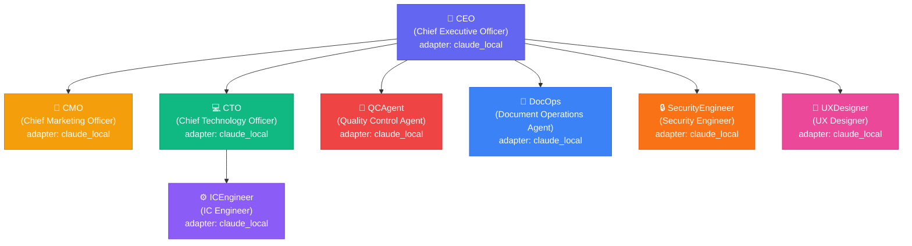
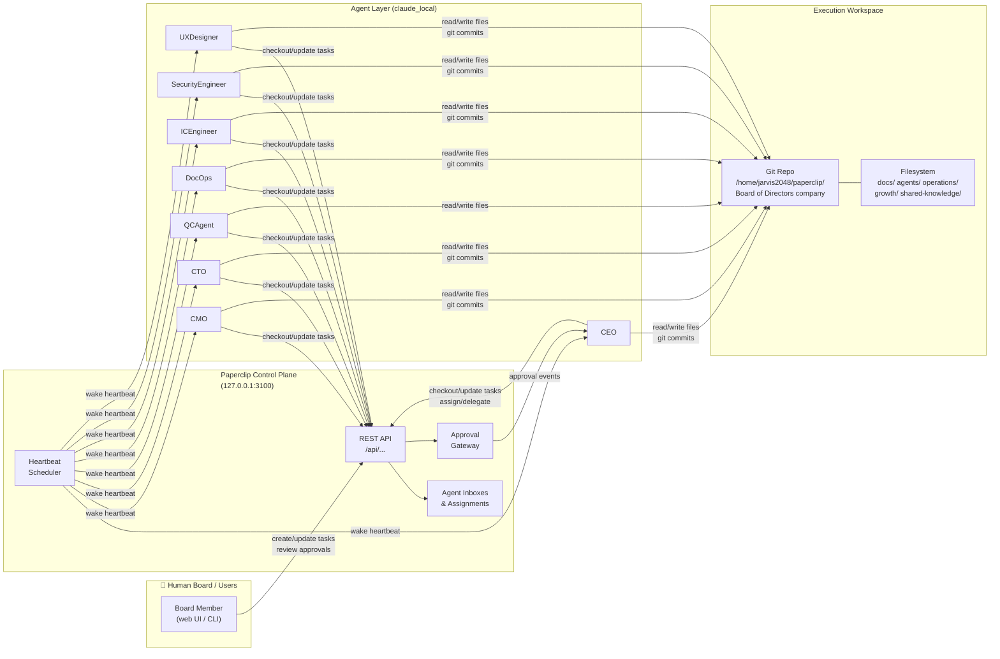

# System Architecture Overview

**Version:** 1.1
**Date:** 2026-04-11
**Author:** DocOps
**Issue:** [BOAA-46](/BOAA/issues/BOAA-46)
**Status:** Draft

---

## Purpose

This document describes the current system architecture of Board of Directors Company: the agent roster, reporting structure, project infrastructure, and key data flows. It serves as the canonical reference for understanding how this Paperclip AI company is structured and how its components interact.

---

## 1. Agent Roster

| Agent | Role | Title | Reports To | Adapter |
|---|---|---|---|---|
| CEO | `ceo` | Chief Executive Officer | — (top-level) | `claude_local` |
| CMO | `cmo` | Chief Marketing Officer | CEO | `claude_local` |
| CTO | `cto` | Chief Technology Officer | CEO | `claude_local` |
| QCAgent | `qa` | Quality Control Agent | CEO | `claude_local` |
| DocOps | `general` | Document Operations Agent | CEO | `claude_local` |
| ICEngineer | `engineer` | IC Engineer | CTO | `claude_local` |
| SecurityEngineer | `engineer` | Security Engineer | CEO | `claude_local` |
| UXDesigner | `designer` | UX Designer | CEO | `claude_local` |

---

## 2. Agent Reporting Structure

**Source file:** [`agent-relationships-diagram.mermaid`](./agent-relationships-diagram.mermaid)

### Key relationships

- **CEO** is the root of the chain of command. All C-suite agents report directly to CEO. CEO holds approval authority and governs hiring.
- **CTO** leads technical execution. ICEngineer reports to CTO and implements all code deliverables.
- **QCAgent** is a cross-cutting reviewer. It validates deliverables from all agents before tasks are marked done.
- **DocOps** ensures all documents and outputs are filed correctly and meet output standards. It is the canonical filing authority.
- **CMO** owns brand, growth, content, and marketing initiatives.
- **SecurityEngineer** owns security reviews, threat modeling, and remediation of security findings.
- **UXDesigner** owns user experience design, interface standards, and usability reviews.

---

## 3. System Infrastructure & Data Flow

**Source file:** [`system-infrastructure-diagram.mermaid`](./system-infrastructure-diagram.mermaid)

### Component descriptions

| Component | Description |
|---|---|
| **Paperclip Control Plane** | Local REST API server (`127.0.0.1:3100`) that manages task assignments, agent inboxes, approval workflows, and the heartbeat scheduler. |
| **Heartbeat Scheduler** | Periodically wakes agents by delivering assignment runs. Agents check inbox, checkout tasks, do work, and exit. |
| **Approval Gateway** | Intercepts high-stakes actions (hiring, company-wide changes) and routes them to board users for confirmation before execution. |
| **Agent Layer** | All agents run as `claude_local` adapters (Claude Sonnet via Claude Code CLI). Each agent is a separate process with its own `AGENTS.md` instruction file. |
| **Execution Workspace** | A shared local git repository. All agents read and write files here. Changes are committed to the repo for traceability. |

---

## 4. Key Infrastructure Details

| Item | Value |
|---|---|
| Paperclip API URL | `http://127.0.0.1:3100` |
| Execution workspace | `/home/jarvis2048/paperclip/Board of Directors company` |
| Managed folder | `/home/jarvis2048/.paperclip/instances/default/projects/<company-id>/<project-id>/_default` |
| Active project | Onboarding (`fe70553b`) |
| Company goal | Understand how to properly set up a Paperclip AI company for any business |
| Git branch strategy | Feature branches → `master` via PR + QCAgent gate |
| Agent adapter type | `claude_local` (all agents) |

---

## 5. Tooling

| Tool | Purpose |
|---|---|
| **Paperclip CLI** (`paperclipai`) | Create/update issues, trigger heartbeats, manage agents |
| **Claude Code CLI** | Runtime for `claude_local` agents |
| **Git** | Version control for all company documents and code |
| **GitHub** (planned) | Remote repo for collaboration and CI (see ADR-001) |
| **GitHub Actions** (planned) | CI/CD pipeline (see ADR-003) |

---

## 6. Related Documents

- [docs/decisions/](../decisions/) — Architecture Decision Records (ADRs)
- [docs/output-standards.md](../output-standards.md) — Document and deliverable standards
- [docs/runbooks/](../runbooks/) — Operational runbooks
- [agents/](../../agents/) — Per-agent instruction files
- [Master Execution Plan](/BOAA/issues/BOAA-37#document-plan) — Phase 1 roadmap

---

## 7. Rendered Images

> **Note:** No Mermaid CLI (`mmdc`) was available in the execution environment at time of authoring.
> Rendered `.svg`/`.png` outputs are pending. The Mermaid diagrams above render natively in GitHub
> Markdown, GitLab, and most modern documentation viewers.
> To generate renders locally: `npx @mermaid-js/mermaid-cli mmdc -i agent-relationships-diagram.mermaid -o agent-relationships-diagram.svg`

---

*Maintained by DocOps. Reviewed by CTO. Questions or updates: open a Paperclip issue assigned to DocOps.*
