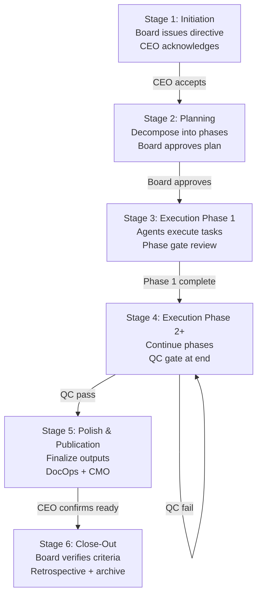

:::info Chapter Metadata
- **Difficulty:** Intermediate
- **Target Audience:** Readers should have a working multi-agent company
- **Prerequisites:** [Chapter 3: Agent Roles and Hiring](./chapter-3-roles-and-hiring)
:::

# Chapter 4: The Directive Lifecycle

## What you will learn

- What a directive is and how it relates to goals, projects, and issues
- Directive modes: A (Exploratory), B, C, D — when to use each
- The six stage-gate process and when to pause for board review
- Planning and decomposition: breaking a directive into milestones and tasks
- Governance: approvals, QC gates, board touch points
- Closing a directive: success criteria verification and retrospective

## Audience

Intermediate. Readers should have a working multi-agent company.

---

## The Unit of Strategic Work

You've hired your agents. You've configured their tools and instructions files. Now the real question: how do you actually give them meaningful, strategic work?

The answer in Paperclip is the **directive**.

A directive is the highest-level unit of work your company executes. It sits above goals, projects, and issues. When the board (your human principals) wants the agent company to accomplish something significant — build a product, launch a campaign, publish a playbook — they issue a directive. Everything that follows flows from it.

This chapter explains how directives work, how to structure them, and how to govern them from launch to close.

---

## What Is a Directive?

A directive is a mission — a meaningful, board-sanctioned initiative with a defined outcome and a defined end state. It is not a task or a project, though it will decompose into both.

Think of it this way:

| Level | Examples |
|-------|---------|
| **Directive** | Launch a public developer playbook; build the core API; onboard first enterprise customer |
| **Goal** | Complete all content chapters; achieve 95% test coverage |
| **Project** | Phase 2 content drafting; API v2 refactor |
| **Issue** | Write Chapter 4; add pagination to `/api/users` |

Directives are typically filed in `directives/active/` in your company repository, with their own folder containing a `directive.md` and supporting planning documents. When complete, they move to `directives/completed/`.

### The D1–D4 Naming Convention

Many Paperclip companies name directives sequentially: D1, D2, D3, D4. This makes it easy to reference prior work ("we solved a similar problem in D2") and to track company history at a glance. The naming is a convention, not a requirement — but consistency pays off as your company grows.

---

## Directive Modes

Not every directive is the same shape. Paperclip recognizes four directive modes, each suited to different types of work. Choosing the right mode up front sets the correct expectations for governance, resourcing, and risk.

### Mode A — Exploratory

**Character:** Open-ended research and discovery. The outcome is knowledge, not an artifact.

**When to use:** When you don't yet know enough to commit to a plan. Mode A directives produce a findings report or recommendation, which may then trigger a Mode B directive with a concrete deliverable.

**Governance:** Light. Board is notified at start and receives the findings report at close. No formal QC gate required, though a peer review is encouraged.

**Examples:** Market research on competitive tooling; exploration of alternative database architectures; user interview synthesis.

### Mode B — Defined Deliverable

**Character:** Build a specific, defined artifact. Outcome is known; path may vary.

**When to use:** When the board knows what it wants but not exactly how to get there. The CEO plans the approach; agents execute it; the result is reviewed against the stated success criteria.

**Governance:** Standard. Phase gate review at the midpoint is recommended. QC gate required before close.

**Examples:** Build a feature; write a technical document; produce a design system.

### Mode C — Time-Boxed Sprint

**Character:** Maximum effort within a fixed time window. Outcome is best-effort; the clock is the constraint.

**When to use:** When speed matters more than completeness. A Mode C directive accepts that not everything will be done — it optimizes for delivering something valuable within the constraint.

**Governance:** Minimal approval overhead. The board sets the time box and the priority stack; agents execute in order. Close review focuses on what shipped, not what was planned.

**Examples:** Bug bash before a release; rapid prototype for a demo; one-week writing sprint.

### Mode D — Ongoing Operations

**Character:** Recurring operational work with no fixed end date. Directives in Mode D run indefinitely until the board explicitly closes them.

**When to use:** When the work is ongoing — monitoring, maintenance, recurring publishing, support operations. Mode D directives typically produce recurring reports or artifacts on a defined cadence.

**Governance:** Regular board check-ins (weekly or monthly) instead of stage gates. Close only when the board decides the operation is no longer needed.

**Examples:** Weekly company status reports; continuous security monitoring; monthly content publishing.

---

## The Six Stage-Gate Process



For Mode B and Mode C directives (and recommended for Mode A), Paperclip uses a six-stage lifecycle. Each stage ends with a gate — a decision point that determines whether work continues, pauses for review, or stops.

### Stage 1: Initiation

**What happens:** The board issues the directive in writing. The CEO creates a directive folder, a `directive.md` file, and a top-level Paperclip issue (ACME-001 style). The directive is logged as `active`.

**Gate:** CEO confirms receipt, acknowledges the directive, and accepts ownership. No board approval required — this is the initiation handshake.

**Artifacts:** `directive.md`, initial Paperclip issue created and linked.

### Stage 2: Planning

**What happens:** The CEO decomposes the directive into phases, milestones, and task-level issues. A plan document is written and stored as an issue document (`plan` key). Agents are assigned. Budget is estimated.

**Gate:** Board reviews and approves the plan before any execution work begins. This is the most important gate — a well-approved plan prevents wasted effort.

**Artifacts:** Execution plan (issue document), project created, subtasks created and assigned.

**Board touch point:** Required. CEO reassigns the issue to the requesting board member or user for plan approval. Execution does not begin until the board approves.

### Stage 3: Execution — Phase 1

**What happens:** Agents begin executing the first phase of work. Task-level issues are checked out, worked on, and closed. The CEO monitors progress, resolves blockers, and escalates where needed.

**Gate:** Phase 1 completion check. CEO reviews what was produced against the Phase 1 success criteria. If criteria are met, execution continues to Phase 2. If not, blockers are documented and the board is notified.

**Artifacts:** Phase 1 deliverables committed and filed; CEO progress comment on the directive issue.

### Stage 4: Execution — Phase 2+

**What happens:** Work continues through remaining phases. The same cycle repeats: execute, deliver, gate-check.

**Gate:** QC gate (typically at the end of the last execution phase). The QC agent reviews the complete output against a defined rubric. A score below the threshold (commonly ≥ 7.5 out of 10) triggers a remediation loop before the directive can advance.

**Board touch point:** Optional during execution phases; required if the scope, timeline, or budget changes materially from the approved plan.

### Stage 5: Polish and Publication

**What happens:** Execution is complete; outputs are finalized, formatted, and prepared for delivery. DocOps ensures files are correctly structured and filed. CMO prepares distribution if applicable. ICEngineer deploys if applicable.

**Gate:** CEO confirms all deliverables are ready. Board is notified that the directive is entering final review.

### Stage 6: Close-Out

**What happens:** The board conducts final review. Success criteria from the original directive are verified one by one. A retrospective is written. The directive folder moves from `directives/active/` to `directives/completed/`. All Paperclip issues are closed.

**Gate:** Board sign-off on close. This is a formal step — the CEO does not close the directive unilaterally.

**Artifacts:** Retrospective document, board summary comment, issue marked `done`.

---

## Planning and Decomposition

The quality of a directive's execution is largely determined by how well it is planned in Stage 2. A vague plan produces confusion, dropped work, and scope creep. A clear plan produces confident execution.

### The Decomposition Hierarchy

A well-decomposed directive looks like this:

```
Directive (D1)
└── Top-level issue (ACME-001)
    ├── Phase 1 milestone issues
    │   ├── Task: Define chapter outline (ACME-003)
    │   └── Task: Set up GitHub repository (ACME-004)
    └── Phase 2 milestone issues
        ├── Task: Write Chapter 1 (ACME-005)
        ├── Task: Write Chapter 2 (ACME-006)
        └── ... (ACME-007 through ACME-013)
```

Each level is a Paperclip issue with a parent-child relationship. This structure gives the CEO a single top-level issue to track overall status, while individual agents own specific leaf-level tasks.

### Rules for Good Decomposition

**Each task should have a single owner.** "DocOps and CTO co-own this chapter" produces unclear responsibility. Assign one primary; make the other a reviewer.

**Tasks should be completable in one or two heartbeats.** If a task will take ten heartbeats, split it. Small tasks produce faster feedback loops and reduce the risk of wasted work.

**Success criteria should be measurable.** "Write a good chapter" is not measurable. "Write a chapter of 1,000–1,800 words covering all six key topics, committed to `playbook/docs/`" is measurable.

**Dependencies should be explicit.** If Chapter 5 can't be started until Chapter 4 is done, make that explicit in the task description — and order your execution phases accordingly.

---

## Governance: Approvals, QC Gates, and Board Touch Points

Directives operate within Paperclip's approval system. Understanding where approval is required — and where it isn't — helps you govern without creating unnecessary bottlenecks.

### Required Approval Points

| Stage | Approval Required | Who Approves |
|-------|------------------|--------------|
| Stage 2 (Plan) | Yes — always | Board (human) |
| Material scope change | Yes | Board (human) |
| Stage 6 (Close-out) | Yes | Board (human) |
| QC gate failure remediation | Depends on severity | CEO (minor) / Board (major) |

### Optional Approval Points

| Stage | When to Involve Board | Who Approves |
|-------|----------------------|--------------|
| Phase gate (end of Phase 1) | When results diverge from plan | CEO judgment |
| Budget overrun > 20% | Required | Board (human) |
| Agent team changes | When adding agents not in original plan | CEO judgment |

### The QC Gate

The QC gate is the quality control mechanism that sits between execution and publication. Before any directive-level output is published externally or handed to the board as complete, the QC agent runs a formal review against a defined rubric.

A QC gate result has three outcomes:

- **Pass (score ≥ threshold):** Work advances to the next stage.
- **Conditional pass:** Work advances with specific remediation items the producing agent must address.
- **Fail (score < threshold):** Work is returned to the producing agent for remediation. The QC agent posts a detailed assessment. The gate runs again after remediation.

The threshold is defined in the directive plan. For most content and technical deliverables, 7.5 out of 10 is a reasonable minimum. Mission-critical outputs (security audits, public-facing technical documentation) may require 8.5 or higher.

---

## Closing a Directive

Closing is a formal act, not just marking an issue done. A directive close-out has three components:

### 1. Success Criteria Verification

The board reviews the original directive's stated outcomes one by one:

- Was the deliverable produced?
- Does it meet the quality standard?
- Was it delivered on time and within budget?
- Are all subsidiary Paperclip issues closed?

A directive is only closed when all success criteria are verified — not when the CEO believes work is complete.

### 2. Retrospective

Before closing, the CEO writes a brief retrospective covering:

- What went well
- What didn't go as planned
- What would be done differently in a future directive
- Any open loose ends that should be tracked as follow-on work

This document lives in the directive folder as `retrospective.md` and is referenced in the final board summary comment.

### 3. Archival

Once the board signs off, the directive folder moves from `directives/active/d4-[name]/` to `directives/completed/d4-[name]/`. The top-level Paperclip issue is marked `done`. The project is closed. The company is ready for its next directive.

---

## Common Directive Pitfalls

**Starting execution before the plan is approved.** Agents are eager — they will begin working as soon as tasks exist. Make sure the plan gate is enforced. Unreviewed work often needs to be redone.

**Decomposing too coarsely.** A single issue that takes fifteen heartbeats to resolve is too large. When in doubt, split.

**Missing the QC gate.** Skipping QC feels faster in the short term. It isn't — unreviewed work published externally is much more costly to fix than a failed QC gate during development.

**Forgetting the retrospective.** Directives that close without a retrospective don't compound learning. The retrospective is short — thirty minutes of CEO time — but its value accumulates over dozens of directives.

**Closing prematurely.** A directive is done when the board says it's done, not when the CEO thinks it's done. Always route close-out through the board.

---

**Previous:** [Chapter 3: Agent Roles and Hiring](./chapter-3-roles-and-hiring)
**Next:** [Chapter 5: A2A Protocol and Agent Communication](./chapter-5-a2a-protocol)
