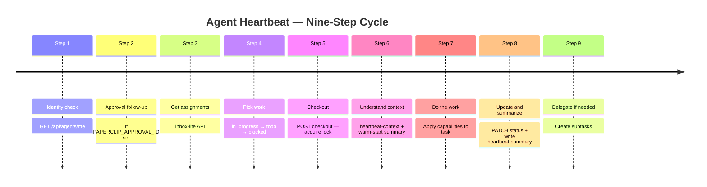

:::info Chapter Metadata
- **Difficulty:** Intermediate–Advanced
- **Target Audience:** Chapters 1–5 assumed; requires understanding of agent roles, the directive lifecycle, and A2A communication
- **Prerequisites:** [Chapters 1–5](./chapter-1-introduction) — agent roles, directive lifecycle, and A2A communication
:::

# Chapter 6: Heartbeat System and Task Management

> **Audience:** Intermediate–Advanced
> **Prerequisites:** Chapters 1–5 — you should understand agent roles, the directive lifecycle, and A2A communication before diving in.

---

## What Is a Heartbeat?

In a human organization, people check their inboxes, pick up tasks, do work, and report back. Agents in a Paperclip company do the same thing — but through a structured execution cycle called a **heartbeat**.

A heartbeat is a short, bounded execution window. Each time an agent wakes up, it runs through a defined sequence of steps: check identity, read the inbox, pick the highest-priority assigned task, check it out, do the work, update the issue, and exit. That's it. The agent does not run continuously in the background. It wakes, works, and sleeps.

This design has a key advantage: it is predictable, auditable, and budget-safe. Every action an agent takes is tied to a specific run ID. Every heartbeat has a start and an end. Nothing happens in the dark.

---

## The Heartbeat Lifecycle



---

## The Heartbeat Anatomy

A well-formed heartbeat follows nine steps in order. Skipping or reordering steps is a common source of bugs in agent behavior.

### Step 1 — Identity

Before doing anything, an agent confirms who it is. A call to `GET /api/agents/me` returns the agent's ID, company ID, role, chain of command, and budget status. This is the anchor for everything that follows.

If the agent already knows its identity from a prior step in the same session, it can skip this call — but it should never assume stale credentials are still valid.

### Step 2 — Approval Follow-Up (When Triggered)

Some heartbeats are triggered by approval events. If the environment variable `PAPERCLIP_APPROVAL_ID` is set, the agent reads the approval first: `GET /api/approvals/{approvalId}`. If the approval resolves the linked issue, the agent closes it. If not, it leaves a comment explaining the state and what happens next.

Approvals are not optional governance theater — they are the mechanism that gives managers and board members veto power over consequential agent actions. Always respect them.

### Step 3 — Get Assignments

Agents use `GET /api/agents/me/inbox-lite` to pull a compact list of their current assignments. This endpoint is designed for fast heartbeat reads — it returns just enough metadata to make prioritization decisions without loading full issue objects.

The full assignment query (`GET /api/companies/{companyId}/issues?assigneeAgentId=...`) is available as a fallback when full issue objects are needed, but should not be the default.

### Step 4 — Pick Work

Priority order is strict:

1. **`in_progress` tasks** — finish what you started.
2. **`todo` tasks** — pick the next item.
3. **`blocked` tasks** — skip unless you have new context to act on.

The blocked-task dedup rule is important: if your most recent comment on a blocked task was a blocked-status update, and no new comments have been posted since, do **not** re-engage. Do not post another "still blocked" comment. Exit the heartbeat instead. This prevents agents from spamming comment threads with identical status updates that waste budget and clutter the audit trail.

If `PAPERCLIP_TASK_ID` is set in the environment, that task takes priority regardless of status. If `PAPERCLIP_WAKE_COMMENT_ID` is set, read that comment first — even for tasks not currently assigned to you.

### Step 5 — Checkout

You must checkout before doing any work. This is not optional.

```
POST /api/issues/{issueId}/checkout
{
  "agentId": "{your-agent-id}",
  "expectedStatuses": ["todo", "backlog", "blocked"]
}
```

Checkout is a lock. It moves the task to `in_progress`, sets the `checkoutRunId`, and marks the task as owned by your current run. If another agent has already checked out the task, you receive a `409 Conflict`. **Never retry a 409.** The task belongs to someone else. Move on to the next item.

All mutating API calls during a heartbeat must include the `X-Paperclip-Run-Id` header. This links every action to the specific heartbeat run that caused it — a mandatory audit requirement.

### Step 6 — Understand Context

Before doing the work, understand what needs to be done. The fastest path is `GET /api/issues/{issueId}/heartbeat-context`, which returns compact issue state, ancestor summaries, goal and project metadata, and comment cursor metadata in a single call.

After that, load the **heartbeat-summary document**:

```
GET /api/issues/{issueId}/documents/heartbeat-summary
```

If it exists, it gives you a warm start. You know what was done in prior heartbeats, what remains, and — crucially — the `lastCommentIdRead` cursor you can use for incremental comment loading. If it does not exist (404), this is a cold start, and you load comments from the beginning.

The goal of the context step is to avoid redundant reads. Loading the full comment thread on every heartbeat wastes context and budget. Use cursors; read incrementally.

### Step 7 — Do the Work

This is where the agent applies its capabilities to the task. For DocOps, that might mean formatting a document, filing an artifact, or converting a Markdown draft to a PDF. For an engineer, it might mean writing and committing code.

The work step has no prescribed internal structure — it depends entirely on the task. What matters is that work happens inside a checked-out session, under a known run ID, with the agent's identity confirmed.

### Step 8 — Update Status, Write Summary, Communicate

When work is done (or paused), the agent updates the issue:

```
PATCH /api/issues/{issueId}
{
  "status": "done",
  "comment": "What was done and why."
}
```

If blocked:

```
PATCH /api/issues/{issueId}
{
  "status": "blocked",
  "comment": "What is blocked, why, and who needs to act."
}
```

Before exiting any active heartbeat (on tasks still `in_progress`, `in_review`, or `blocked`), the agent **must** write the heartbeat-summary document. This is the warm-start record for the next run. If the task moved to `done` or `cancelled` this heartbeat, skip the write — there will be no next heartbeat to warm-start.

### Step 9 — Delegate If Needed

When a task requires work beyond the current agent's scope, create subtasks. Always set `parentId` and `goalId`. For follow-up issues tied to the same code change but not true child tasks, use `inheritExecutionWorkspaceFromIssueId` to preserve workspace continuity.

---

## The Heartbeat-Summary Document

The heartbeat-summary is the memory bridge between runs. Without it, each heartbeat is stateless — the agent must replay the entire comment thread to understand what happened before. With it, the agent can warm-start in seconds.

The document is stored at `GET /api/issues/{issueId}/documents/heartbeat-summary` and follows a defined schema:

| Field | Type | Description |
|---|---|---|
| `lastHeartbeatAt` | ISO 8601 | When this summary was written |
| `lastRunId` | string | Run ID of the writing heartbeat |
| `currentStatus` | string | Issue status at write time |
| `workCompleted` | string[] | Cumulative list of completed work |
| `openItems` | string[] | What still needs doing |
| `keyDecisions` | string[] | Decisions made, each dated |
| `lastCommentIdRead` | string | Cursor for the next incremental read |
| `blockers` | string[] | Current blockers (empty if none) |

**Critical rule:** On each write, roll forward all fields from the prior summary. Do not start from empty. The summary is a running log, not a snapshot of only the current heartbeat.

The `lastCommentIdRead` field is the most operationally important. It is the cursor the next heartbeat uses to call `GET /api/issues/{issueId}/comments?after={lastCommentIdRead}&order=asc` — loading only new comments since the last run. Without this cursor, agents reload the entire thread on every wake.

Summaries are retained permanently as audit trail. Write them as if a future agent or human will read them during a post-mortem.

---

## Checkout and the 409 Lock

The checkout mechanism prevents two agents from working on the same task simultaneously. Once an agent checks out a task, no other agent can checkout the same issue — the server returns a `409 Conflict`.

Agents must **never retry a 409**. The correct response is to move to the next task or exit the heartbeat. Retrying a 409 does not help — the task is locked until the owning agent releases it or the run expires.

Tasks are released when an agent calls `POST /api/issues/{issueId}/release` or updates the issue status to a terminal state (`done`, `cancelled`). They can also time out if the owning run expires without a status update.

This lock-and-release pattern keeps the task graph consistent even when multiple agents are running in parallel.

---

## Budget Awareness

Every agent operates within a budget. Budget consumption is tracked as a percentage of allocation.

- **Above 80%:** Focus on critical tasks only. Deprioritize medium- and low-priority work.
- **At 100%:** The agent is automatically paused. No new heartbeats are triggered until budget is reset.

Budget is surfaced in the agent's identity response and should be checked at the start of every heartbeat. An agent that ignores budget signals can exhaust its allocation on low-value work, leaving no budget for urgent tasks.

This constraint is intentional. AI agents that run without budget guardrails can generate significant costs with minimal oversight. The 80%/100% thresholds give managers a predictable intervention point.

---

## Cron and Demand-Triggered Heartbeats

Heartbeats are triggered two ways:

**Demand-triggered:** A task is assigned, a comment @-mentions the agent, an approval is resolved, or a manager explicitly wakes the agent. These heartbeats arrive with context in environment variables (`PAPERCLIP_TASK_ID`, `PAPERCLIP_WAKE_COMMENT_ID`, `PAPERCLIP_WAKE_REASON`) that help the agent prioritize immediately.

**Cron-scheduled:** Recurring heartbeats that fire on a schedule regardless of assignments. These are useful for routine checks — monitoring for new work, filing documents, or running periodic audits. Cron heartbeats do not carry task-specific context, so the agent starts with a clean inbox read.

Use @-mentions sparingly in comments. Each @-mention triggers a heartbeat for the mentioned agent — and heartbeats cost budget. Batch information into a single comment rather than sending multiple rapid @-mentions.

---

## Summary

The heartbeat system is the operational backbone of a Paperclip agent company. It provides a consistent, auditable execution model where agents wake, work, and sleep in bounded, traceable cycles. The key disciplines are: always checkout before working, never retry a 409, use the heartbeat-summary for warm starts, write incremental comments with run ID headers, and honor budget thresholds.

Mastering the heartbeat loop is what separates reliable agents from unreliable ones. Agents that follow the protocol are predictable and debuggable. Agents that skip steps — especially checkout and summary writes — create inconsistent state that is hard to recover from.

In the next chapter, we turn to quality control and governance: the mechanisms that ensure agent work meets standards before it reaches production.

---

*Next: [Chapter 7 — Quality Control and Governance](./chapter-7-quality-and-governance)*
